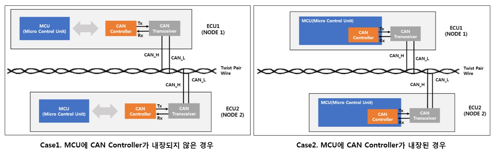
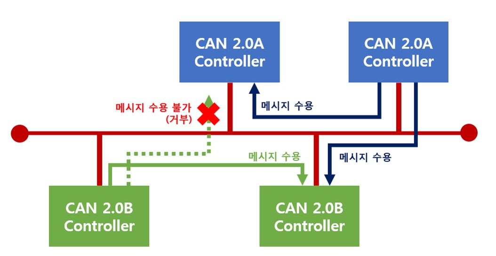
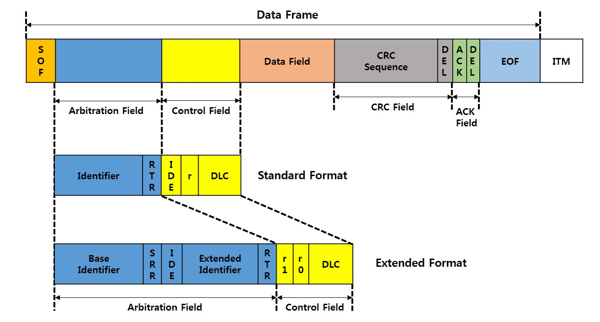
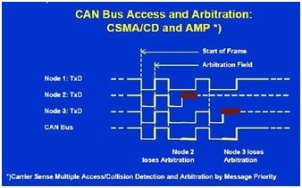

# CAN(Controller Area Network)

### 개요

차량 내에서 호스트 컴퓨터 없이 마이크로 컨트롤러나 장치들이 서로 통신하기 위해 설계된 **표준 통신 규격**이다. 차량 내 ECU(Electronic Control Unit)들은 CAN 프로토콜을 사용하여 통신한다. 기본적으로 **CSMA/CA** + **AMP(Carrier Sense Multiple Access/Collision Detection with Arbitration on Message Priority)** 방식을 이용한다.

### 등장배경

초기 자동차 안에는 모듈이 많지 않아 UART(Point-To-Point) 방식으로 ECU를 연결했다. 하지만 현대 자동차 안에는 모듈이 많아져 UART 방식으로 하게 되면 많은 선이 필요하게 된다. 이에 따라 유지 보수 문제, 배선 증가로 인한 무게 증가, 연비 하락의 문제가 발생한다. 이러한 문제를 해결하기 위해 CAN 통신을 사용하기 시작했다.

CAN은 여러 개의 CAN 디바이스가 서로 통신할 수 있는 안정적인 네트워크(다중 통신 방식, Multi Master 방식)를 제공한다. 이와 같은 네트워크는 ECU가 시스템 내 각 디바이스마다 아날로그 및 디지털 입력을 갖는 것이 아닌 단일의 CAN 인터페이스만 보유한다.

### 특징

1. **메시지 지향성 프로토콜(Message-Oriented Protocol)**
   - CAN은 노드의 주소에 의해 데이터가 교환되는 것이 아닌 **메시지의 우선순위에 따라 ID를 할당하고, 이 ID를 이용해 메시지를 구별**하는 방식을 사용한다.
2. **멀티 마스터 능력**
   - CAN 기반 네트워크는 버스를 점유하기 위한 감독자 노드(Bus Master)의 필요가 없다.
   - 모든 노드가 버스 마스터가 되어 버스가 비어 있을 때라면 언제든지 메시지 전송이 가능하다.
   - **우선순위가 높은 메시지(낮은 ID 번호를 가진)**가 먼저 전송이 된다.
3. **보완적인 에러 감지 메커니즘**
   - CAN은 다양한 에러 감지 메커니즘이 상호 보완적으로 에러를 감지하기 때문에 높은 안정성을 보장한다.
   - 메시지 전송 시, 에러가 감지되면 자동적으로 해당 메시지를 즉시 재전송하는 기능이 있기 때문에 다른 프로토콜에 비해 에러 회복 시간이 짧다.
4. **결점 있는 노드의 감지와 비활성화**
   - CAN은 버스의 상태를 항상 모니터링하기 때문에 **실시간으로 결함이 있는 노드를 감지해 해당 노드를 비활성화함**으로써 **네트워크 신뢰성을 보장**한다.
5. **전기적 노이즈에 강함**
   - **꼬인 2선(Twist Pair Wire, *CAN_H, CAN_L)**을 이용하여 전기적으로 차별되는 통신을 하여 **전기적 노이즈에 매우 강하다**.
6. **저렴한 가격 및 구성 용이성**
   - 현재 수십 개의 반도체 제조업체가 다양한 CAN 컨트롤러와 트랜시버를 개발 및 판매하고 있어 가격이 저렴하고 조달이 용이하다.

### CAN 통신  프로토콜

#### CAN 프로토콜 규격

CAN 메세지에 있는 **식별자(ID)의 길이**에 따라 두 가지 모드로 구분이 된다.

- 표준 CAN(버전 2.0A): 11비트 ID
- 확장 CAN(버전 2.0B): 29비트 ID

ISO 규격에 따라 통신 속도에서 차이가 있다.

- ISO 11898: 1Mbps 이상
- ISO 11519: ~125Kbps

대부분의 CAN 2.0A 컨트롤러는 표준 CAN 포맷의 메시지만 전, 수신 가능하며, 확장 CAN(CAN 2.0B)는 양쪽 포맷을 전, 수신 가능하다.

#### CAN 메시지 포멧(구조)

CAN 통신은 OSI 7 Layer은 Pysical Layer만 사용하기 때문에 데이터 전송 단위가 메시지(Message)이다. **CAN 통신에서 데이터 송수신은 메시지 프레임을 사용하여 이루어진다.** CAN에서는 데이터 프레임(Data Frame), 리모트 프레임(Remote Frame), 에러 프레임(Error Frame), 오버로드 프레임(Overload Frame)의 4가지 프레임 타입을 정의하고 있다.

- **데이터 프레임(Data Frame)**

  - 일반적으로 데이터 전송에 사용된다.

- **리모트 프레임(Remote Frame)**

  - 수신 노드에서 송신 노드에 전송을 요청할 때 사용된다.
  - Arbitration field에는 transmitter의 ID가 포함되며 data field가 없는 것이 특징이다.

- **에러 프레임(Error Frame)**

  - 에러가 감지되었을 때, 시스템에 알릴 목적으로 사용된다.
  - Error를 감지한 node가 6 dominant bit를 출력하면 다른 node는 이에 반응 (stuff error)하여 6 dominant bit를 출력
  - 6~12 dominant bits (Error Flag) + 8 recessive bits (Error delimiter)로 구성

- **오버로드 프레임(Overload Frame)**

  - 메시지의 동기화를 목적으로 사용된다. 

  - 6 dominant bits (Overload Flag) + 8 recessive bits (Overload delimiter)로 구성

CAN 메시지 프레임의 각 필드

- SOF(Start Of Frame)
  - 한 개의 dominant 비트로 구성되어 있으며, 메시지의 처음을 지시하고 모든 노드의 동기화를 위해 사용된다.
- Arbitration Field(중재 필드)
  - 둘 이상의 놰드에서 메시지의 전송이 동시에 일어날 경우 발생하는 충돌을 조정하는데 사용된다.
  - 11비트 혹은 29비트의 크기를 갖는 ID와 1비트의 RTR(Remote Transmission Request) 비트로 구성된다.
  - RTR비트의 값은 데이터 프레임('d')인지 리모트 프레임('r')인지를 결정하는 데 사용된다.
- Control Field(제어 필드)
  - 2비트의 IDE(IDentifier Extension), 4비트의 데이터 길이 코드(DLC, Data Length Code)로 구성된다.
  - IDE(IDentifier Extension): 표준 프레임과 확장 프레임을 구별한다.
  - DLC(Data Length Code): 데이터 프레임의 데이터 바이트 수, 범위 0~8
- Data Field(데이터 필드)
  - 8bytes까지 사용 가능하며, 데이터를 저장하는 데 사용된다.
- CRC(Cyclic Redundancy Check) Field
  - 메시지 상의 에러 유무를 검사하는 데 사용된다.
  - SOF에서부터 데이터 필드까지의 비트열을 이용해 생성한 15비트의 CRC 시퀀스와 하나의 'r'비트의 CRC 델리미터로 구성되어 있다.
- ACK(ACKnowledge) Field
  - 제대로 메시지를 수신 받았는지 확인하는 데 사용된다.
  - 한 비트의 ACK 슬롯과 하나의 ACK 델리미터('d')로 구성되어 있다.
  - 임의의 노드에서 올바른 메시지를 수신하게 되면 ACK 필드를 받는 순간 ACK 슬롯의 값을 'd'로 설정해 버스 상에서 계속 전송하게 된다.
- EOF(End Of Frame) Field
  - 메시지의 끝을 알리는 목적으로 사용된다.
  - 7개의 'r' 비트로 구성되어 있다.

*참고: 'd'비트: dominant bit(0), 'r'비트: recessive bit(1)*

#### CAN BUS 네트워크 동작원리

CAN은 **다중통신망(Multi Master Network)**이며 **CSMA/CD+AMP(Carrier Sense Multiple Access/Collision Detection with Arbitration on Message Priority) 방식**을 이용한다. 이에 따라 아래와 같은 동작 순서를 따른다.

1. CAN 노드에 메시지를 보내기 전에 CAN 버스라인이 사용 중인지 파악한다.

2. 메시지 간 충돌 검출을 수행한다.(메시지의 수신 측 주소 혹은 송신 측 주소는 포함하지 않는다.)

   - 만약 충돌이 발생하지 않으면 BUS가 *dominant* 상태가 되어 전송을 시작합니다.
   - 만약 충돌이 발생하면 *ID*를 통해 우선순위를 결정합니다. *ID*가 낮을수록 우선순위가 높다.
   - 낮은 우선순위의 메시지는 자동적으로 다음 버스 사이클에 재전송이 되도록 한다.

   

3. 네트워크 상에 연결된 모든 노드는 BUS의 모든 메시지를 수신한 후 자신이 필요로 하는 *ID*의 메시지인 경우 수신한다.

   - 여러 노드의 데이터가 동시에 자신의 노드로 유입되는 경우에, *ID*의 숫자를 비교하여 먼저 취할 메시지의 우선순위를 정한다. 이 경우 또한 낮은 *ID*가 우선순위가 높다.
   - 제대로 수신한 경우 ACK 슬롯의 값을 'd'로 설정해 버스 상에서 계속 전송하게 된다.
   - 에러가 발생한 경우 6 'd' 비트를 출력한다.
   - Receiver의 내부 조건에 의해서 다음 data/remote frame 사이에 delay가 필요한 경우 Overload Frame을 전송한다.

### 버스 형태에서 발생하는 문제

버스형태: 신호가 네트워크 안에 머물러 있는 경우가 있다. => 종단 저항을 달아줘야 한다. 임피던스 매칭

대역폭 문제 느린거

끊기면 다 잘림

### 참고자료

- CAN 통신의 이해 (https://www.fescaro.com/ko/archives/249)

- 도닦는 공돌이_CAN통신 기초(https://electronicsdo.tistory.com/entry/CAN%ED%86%B5%EC%8B%A0%EC%9D%98-%EA%B8%B0%EC%B4%884-1?category=383557)

