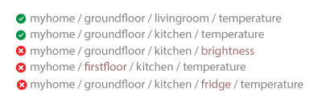
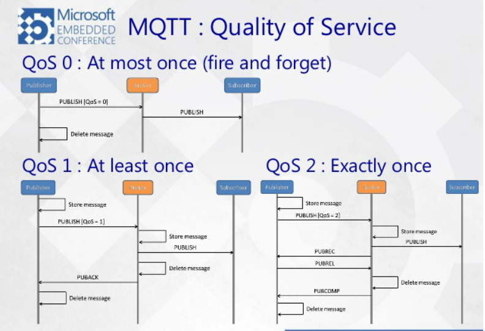
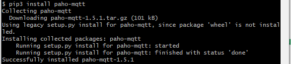

# MQTT (Message Queuing Telemtry Transport)

## 개요

- ISO 표준(ISO/IEC PRF 20922) **발행(Publish)** - **구독(Subscribe)** 기반 메시징 프로토콜
- MQTT를 활용한 Facebook 메신저 개발


## 특징

- IoT를 위해서 낮은 전력, 낮은 대역폭 환경에서도 사용할 수 있도록 설계


## MQTT 용어

- 게시자(Publisher): 특정 Topic으로 메시지를 전송하는 클라이언트
- 구독자(Subscriber): 특정 Topic에 들어오는 메시지를 감시하는 클라이언트
- 중개자(Broker): 클라이언트를 연결시켜주는 서버


- 토픽(Topic): 계층적 구조를 갖는 정보의 위치

  - 파일 시스템 형식 => 정보의 효율적인 관리
  - 슬래쉬(/)로 계층 구분
  - Single Level Wildcard(+): 하나의 토픽 레벨을 대체

  

  

  - Multi Level Wildcard(#): 여러 토픽 레벨을 대체
    

    


### QoS(Quality of Service)



- **레벨 0**: 
  - 메시지는 한번만 전달된다. 
  - 한번에 전송이 성공하지 않으면 전송은 실패한 상태로 끝이 난다.
  - QoS를 보장하지 않는 상태
- **레벨 1**: 
  - 최소 한번은 가게 된다.
  - 메시지가 성공적으로 전달하면 Broker가 Publisher에게 PUBACK을 보내어 전달 성공을 알린다.
  - 만약 정상적 통신이 이뤄지지 않을 경우 LOSS가 발생하여 PUBACK을 받지 못하여 Publisher는 적정 시간이 지나 실패로 알고 다시 메시지를 보내어 Subscribe에게 중복메시지를 보내는 경우가 생긴다.
- **레벨 2**:
  - 메시지는 반드시 한번 전달된다.
  - 위의 있는 PUBACK 과정을 PUBREC으로 핸드 셰이킹을 함으로써 메시지가 정확히 한번만 가는 레벨이다.
  - 만약 위의 과정처럼 Broker가 PUBREC을 전달 받지 못해 Loss가 일어나게 되어도 Broker는 이미 보냈다는 사실을 알고 있기 대문에 새로 보내지 않는다.


## MQTT 환경 구축하기

**HIVE-MQ broker **를 사용해서 MQTT를 구축해보았다.

- Python 설치(Python 3.7.9 사용)

- paho-mqtt 라이브러리 설치
  

- **publish.py**

  ```python
  import paho.mqtt.client as mqtt
  import json
  
  def on_connect(client, userdata, flags, rc):
      if rc == 0:
          print("Connection OK")
      else:
          print("Bad connection Returned code= ", rc)
  
  def on_disconnect(client, userdata, mid):
      print("In on_pub callback mid= ", mid)
  
  def on_publish(client, userdata, mid):
      print("In on_pub callback mid= ", mid)
  
  
  # 새로운 클라이언트 생성
  client = mqtt.Client()
  # 콜백 함수 설정 on_connect(브로커에 접속)
  # on_disconnect(브로커에 접속종료)
  # on_publsih(메세지 발행)
  client.on_connect = on_connect
  client.on_disconnect = on_disconnect
  client.on_publish = on_publish
  # address : broker.mqttdashboard.com, port: 1883 에 연결
  # broker.mqttdashboard.com는 public broker이다.
  client.connect("broker.mqttdashboard.com", 1883)
  client.loop_start()
  # common topic으로 메시지 발행
  client.publish('common', json.dumps({"succcess": "ok"}), 1)
  client.loop_stop()
  # 연결 종료
  client.disconnect()
  ```

- **subscribe.py**

  ```python
  import paho.mqtt.client as mqtt
  
  
  def on_connect(client, userdata, flags, rc):
      if rc == 0:
          print("connected OK")
      else:
          print("Bad connection Returned code=", rc)
  
  
  def on_disconnect(client, userdata, flags, rc=0):
      print(str(rc))
  
  
  def on_subscribe(client, userdata, mid, granted_qos):
      print("subscribed: " + str(mid) + " " + str(granted_qos))
  
  
  def on_message(client, userdata, msg):
      print(str(msg.payload.decode("utf-8")))
  
  
  # 새로운 클라이언트 생성
  client = mqtt.Client()
  # 콜백 함수 설정
  # on_connect(브로커에 접속)
  # on_disconnect(브로커에 접속중료), on_subscribe(topic 구독),
  # on_message(발행된 메세지가 들어왔을 때)
  client.on_connect = on_connect
  client.on_disconnect = on_disconnect
  client.on_subscribe = on_subscribe
  client.on_message = on_message
  # address : broker.mqttdashboard.com, port: 1883 에 연결
  # broker.mqttdashboard.com는 public broker이다
  client.connect("broker.mqttdashboard.com", 1883)
  # common topic 으로 메세지 발행
  client.subscribe('common', 1)
  client.loop_forever()
  ```

- ```bash
  python subscribe.py
  ```

- ```bash
  python publish.py
  ```
  
  **result**
  
  


## 참고자료

[통신 이론] MQTT, MQTT Protocol (MQTT 프로토콜) 이란? - 1 (이론편) (https://underflow101.tistory.com/22)

MQTT 실전 응용하기 — WildCard (https://medium.com/@jspark141515/mqtt-%EC%8B%A4%EC%A0%84-%EC%9D%91%EC%9A%A9%ED%95%98%EA%B8%B0-wildcard-9643877262f2)

Python 에서 MQTT 사용하기 (https://developer-finn.tistory.com/1)

